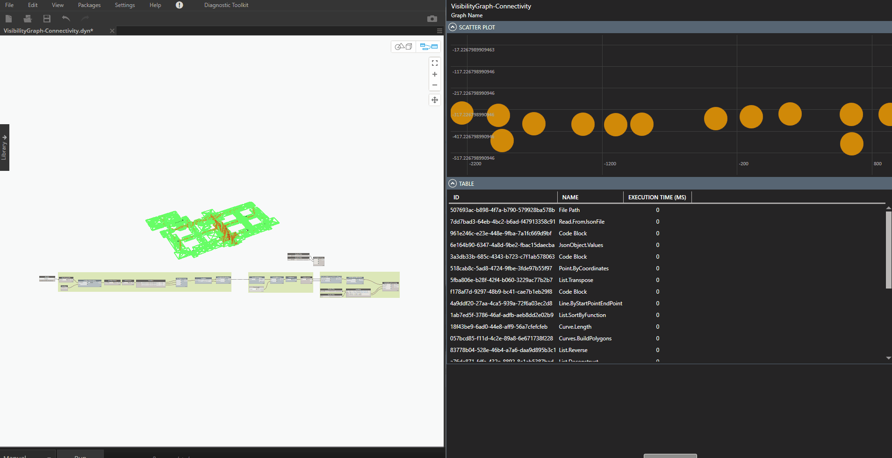

# Diagnostic Toolkit for Dynamo

Dynamo View Extension to provide performance information for a Dynamo graph, node by node. :rocket:

> **IMPORTANT**
> 
> Only available for Dynamo Version `2.3.0.5885` and above. The toolkit will tell you off if trying to use it on a lower version.

> **ALSO IMPORTANT**
> 
> This is very much WIP. Please complain as much as you want so we can improve it faster :)

## Known Issues

- When opening a saved file, it will require to be run twice to enable the performance profiling. Working on finding a solution.
- Running a graph might take longer during profiling, hopefully this can be minimized in the future.

